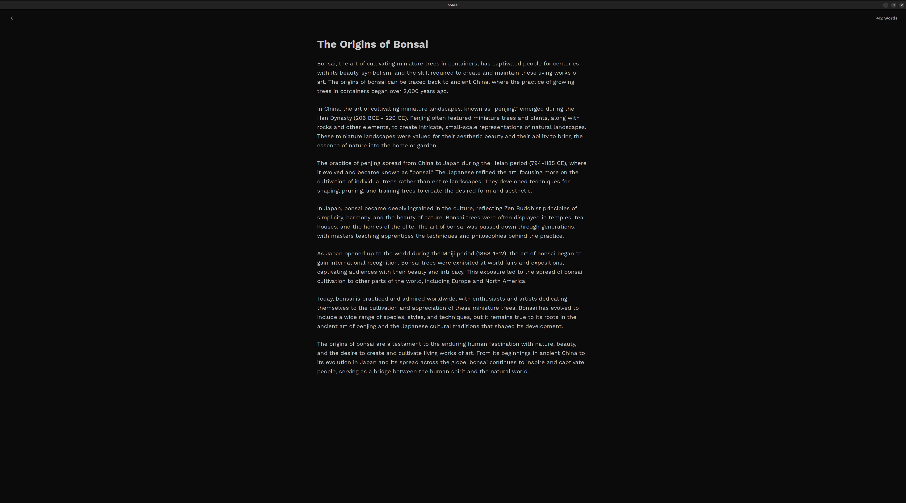

  
  <h1 style="margin: 0; padding-top: 8px;">Bonsai</h1>

- Bonsai is a local-first, AI-native rich text editor aimed at providing a clean and minimalistic editing environment for content creators.

## Tech Stack
- Tauri
- React
- Tiptap
